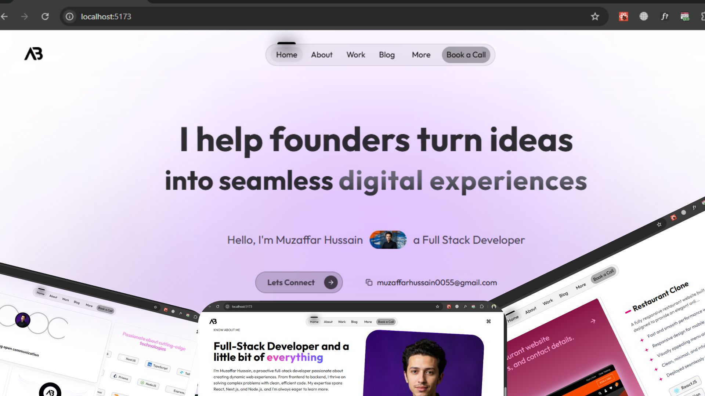

# 🌐 Portfolio Website

A modern, responsive, and interactive personal portfolio website built to showcase my projects, skills, and professional journey.  
Designed with a focus on **performance, accessibility, and clean UI animations**.

 

---

## 🚀 Features

- **Responsive Design** — Works seamlessly on desktop, tablet, and mobile.
- **Modern UI** — Built with Tailwind CSS and Framer Motion for smooth animations.
- **Project Showcase** — Highlighting my best work with interactive cards and details.
- **About & Skills Section** — Presenting my technical and soft skills.
- **Contact & Call-to-Action** — Easy ways for recruiters or clients to reach me.


---

## 🛠 Tech Stack

**Frontend:**
- [React.js](https://reactjs.org/)
- [React Router](https://reactrouter.com/)
- [Tailwind CSS](https://tailwindcss.com/)
- [Framer Motion](https://www.framer.com/motion/)

**Icons & Graphics:**
- [Lucide Icons](https://lucide.dev/)
- Custom SVG Illustrations

---

## 📂 Project Structure

```plaintext
├── public/               # Static assets
├── src/
│   ├── assets/           # Images, icons, and media files
│   ├── components/       # Reusable UI components
│   ├── pages/            # Website pages (Home, About, Work, Contact, Blog)
│   ├── index.css/           # Tailwind configuration & custom CSS
│   ├── App.jsx           # Main app entry
│   └── main.jsx          # React DOM render
└── package.json
